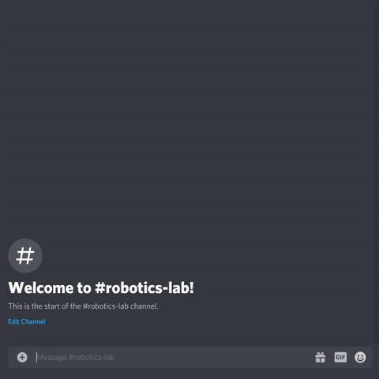

 

# eecsBot
Discord Bot for the Berkeley EECS Discord server

## Features
- berkeley.edu e-mail verification
- berkeleytime course information
- moderator announcement creator with REPL prompts
- topic collection, suggestion, and polling
- ... and more!

 

 

